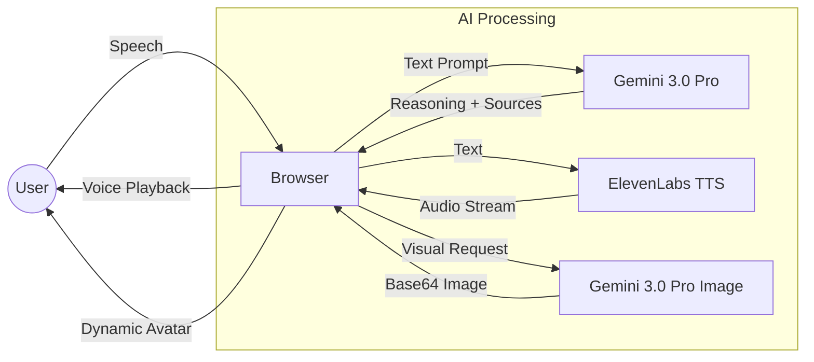

# TimeDial ⏳📞
> **Immersive Real-Time History Teacher powered by Bleeding-Edge AI.**


[**🎥 WATCH THE DEMO VIDEO**](#) *(Link coming soon)*

---

## 🧐 The Problem & Solution

**The Problem:**
History education is stuck in the past. Textbooks are static, lectures are passive, and students struggle to connect with figures who lived thousands of years ago. It’s hard to feel the weight of Cleopatra’s decisions or Einstein’s curiosity through flat text.

**The TimeDial Solution:**
TimeDial shatters the "textbook barrier" by letting students pick up the phone and **talk directly to history**. 
TimeDial is an ultra-low-latency voice interface that brings historical figures to life. We don't just "simulate" chat; we model persona, tone, and speech patterns to create an immersive, educational experience that feels like a real conversation.

---

## 🏛️ Meet the Legends

TimeDial features a curated roster of polymaths and leaders, each with unique voice profiles and visual identities:

*   **Albert Einstein:** The father of relativity. *Voice: Deep, authoritative, warm (Antoni).*
*   **Cleopatra VII:** The last Pharaoh. *Voice: Regal, intelligent, commanding (Bella).*
*   **Leonardo da Vinci:** The Renaissance polymath. *Voice: Energetic, artistic, visionary (Josh).* (Features **Real-time AI Portrait Generation**).
*   **Ada Lovelace:** The first programmer. *Voice: Analytical, poetic, precise (Domi).*

---

## ⚙️ How it Works (Architecture)

TimeDial processes multimodal interactions using a hybrid best-in-class pipeline:

1.  **Voice Capture:** The user speaks into the browser (Web Speech API).
2.  **Cognitive Engine (Gemini 3.0 Pro):** The text is sent to **Gemini 3.0 Pro** via the Google GenAI SDK. The model reasons through the persona's historical context to provide an accurate, in-character, and concise response. It also uses **Google Search Grounding** to fact-check responses.
3.  **Voice Synthesis (ElevenLabs):** The text response is streamed to **ElevenLabs Turbo v2.5** for ultra-low latency and hyper-realistic emotional intonation.
4.  **Dynamic Visuals (Gemini Image):** If a character portrait is missing (like Da Vinci's), **Gemini 3.0 Pro Image Preview** generates a museum-grade oil painting on the fly.



---

## 🏆 Hackathon Track Alignment

This project is engineered to win by combining the best tools for each modality:

### 1. Google Cloud / Gemini Track
*   **Gemini 3.0 Pro Integration:** We leverage the reasoning capabilities of 3.0 Pro for the chat brain.
*   **Gemini 3.0 Pro Image:** We use the latest image generation models for real-time visual creation.
*   **Search Grounding:** We enable the model to cite real-world sources.

### 2. ElevenLabs Track (Voice AI)
*   **Turbo v2.5 Model:** We utilize `eleven_turbo_v2_5` to minimize latency to sub-400ms levels.
*   **Character Voice Design:** We carefully map specific Voice IDs to historical personas to ensure emotional resonance.

---

## ⚡ Technical Highlights

*   **Hybrid Latency Optimization:** Text generation (Gemini) and Speech generation (ElevenLabs) run in a tightly coupled async chain.
*   **Resilient Fallbacks:** If Image generation fails, historical fallback images are injected.
*   **Persistent State:** LocalStorage caches generated avatars to save API costs and improve load times on subsequent visits.
*   **Smart Citations:** The interface displays source links when the AI references specific historical facts (powered by Gemini Grounding).

---

## 🚀 Installation & Usage

### Prerequisites
*   Node.js v18+ installed.
*   **Google Gemini API Key** (Get one at [aistudio.google.com](https://aistudio.google.com)).
*   **ElevenLabs API Key**.

### 1. Clone the Repository
```bash
git clone https://github.com/engrtitooo/TimeDial.git
cd timedial
```

### 2. Install Dependencies
```bash
npm install
```

### 3. Configure API Keys
Create a `.env` file in the root directory:
```ini
API_KEY=your_google_gemini_api_key
ELEVENLABS_API_KEY=your_elevenlabs_api_key
```

### 4. Run the App
```bash
npm run dev
```

Visit `http://localhost:5173` in your browser. Allow microphone access, choose a character, and start talking!

---

## 📄 License

This project is licensed under the MIT License - see the [LICENSE](LICENSE) file for details.

---

> *Built with ❤️ for the Hackathon.*